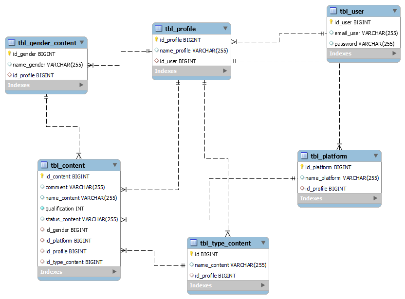

# Your Opinion API

This API solves the need to manage and rate the audiovisual content of users who have profiles.
An MVC framework and architecture is used for database control, in addition to having a security implementation with JWT.


## Installation

To use our Project you must use git to download the repository:

```bash
  git clone https://github.com/johanp0308/flores-el-machete-project-spring.git
```

To execute it, remember that you must have java on your computer to compile and interpret:

- To install java on windows [here](https://www.java.com/es/download/ie_manual.jsp)
- To install java on Linux maybe [here](https://www.java.com/es/download/help/linux_x64_install.html) remember that it may depend on the distro.


## Tech Stack

**Server:** Spring, Spring Boot

**Libreries:** Spring Security, Lombok, JWT, Hibernate, MysqlConector
## Documentation

- [Api Reference](./src/open-api/API_REFERENCE.md)

For the API documentation, start the project and run the following in a browser
- Api Documentation: http://localhost:8080/doc/swagger-ui/index.html#/

## Config

To correctly configure the project you must create a database in your mysql service.

Recuerda el nombre de esa base de datos, porque es que usaremos en ela configuraciones de ellos:

Nos vamos a src/resources/application.properties

```properties
spring.datasource.url=jdbc:mysql://localhost:3306/<database_name>
spring.datasource.username=<user>
spring.datasource.password=<password>
```


## Database Documentation

<body>
<div id="title-sect">
<h1>db_youropinion<br> Data Dictionay</h1>
<p>
<em>2024-04-01</em>
</p>



<p class="proj-desc">
<em></em>
</p>
</div>
<h2>Alphabetic Index</h2>
<ul>
<li><a href='#tbl_content'>tbl_content</a></li>
<li><a href='#tbl_gender_content'>tbl_gender_content</a></li>
<li><a href='#tbl_platform'>tbl_platform</a></li>
<li><a href='#tbl_profile'>tbl_profile</a></li>
<li><a href='#tbl_type_content'>tbl_type_content</a></li>
<li><a href='#tbl_user'>tbl_user</a></li>
</ul>
<table id='tbl_content'>
<caption>tbl_content</caption>
<tr><td colspan='11'></td></tr>
<tr>
    <th>Column name</th>
    <th>DataType</th>
    <th><abbr title='Primary Key'>PK</abbr></th>
    <th><abbr title='Not Null'>NN</abbr></th>
    <th><abbr title='Unique'>UQ</abbr></th>
    <th><abbr title='Binary'>BIN</abbr></th>
    <th><abbr title='Unsigned'>UN</abbr></th>
    <th><abbr title='Zero Fill'>ZF</abbr></th>
    <th><abbr title='Auto Increment'>AI</abbr></th>
    <th>Default</th>
    <th>Comment</th>
</tr>
<tr>
    <td>id_content</td>
    <td>BIGINT</td>
    <td>&#10004;</td>
    <td>&#10004;</td>
    <td>&nbsp;</td>
    <td>&nbsp;</td>
    <td>&nbsp;</td>
    <td>&nbsp;</td>
    <td>&#10004;</td>
    <td></td>
    <td></td>
</tr>
<tr>
    <td>comment</td>
    <td>VARCHAR(255)</td>
    <td>&nbsp;</td>
    <td>&nbsp;</td>
    <td>&nbsp;</td>
    <td>&nbsp;</td>
    <td>&nbsp;</td>
    <td>&nbsp;</td>
    <td class='attr'>&nbsp;</td>
    <td>NULL</td>
    <td></td>
</tr>
<tr>
    <td>name_content</td>
    <td>VARCHAR(255)</td>
    <td>&nbsp;</td>
    <td>&nbsp;</td>
    <td>&nbsp;</td>
    <td>&nbsp;</td>
    <td>&nbsp;</td>
    <td>&nbsp;</td>
    <td class='attr'>&nbsp;</td>
    <td>NULL</td>
    <td></td>
</tr>
<tr>
    <td>qualification</td>
    <td>INT</td>
    <td>&nbsp;</td>
    <td>&#10004;</td>
    <td>&nbsp;</td>
    <td>&nbsp;</td>
    <td>&nbsp;</td>
    <td>&nbsp;</td>
    <td class='attr'>&nbsp;</td>
    <td></td>
    <td></td>
</tr>
<tr>
    <td>status_content</td>
    <td>VARCHAR(255)</td>
    <td>&nbsp;</td>
    <td>&nbsp;</td>
    <td>&nbsp;</td>
    <td>&nbsp;</td>
    <td>&nbsp;</td>
    <td>&nbsp;</td>
    <td class='attr'>&nbsp;</td>
    <td>NULL</td>
    <td></td>
</tr>
<tr>
    <td>id_gender</td>
    <td>BIGINT</td>
    <td>&nbsp;</td>
    <td>&nbsp;</td>
    <td>&nbsp;</td>
    <td>&nbsp;</td>
    <td>&nbsp;</td>
    <td>&nbsp;</td>
    <td class='attr'>&nbsp;</td>
    <td>NULL</td>
    <td></td>
</tr>
<tr>
    <td>id_platform</td>
    <td>BIGINT</td>
    <td>&nbsp;</td>
    <td>&nbsp;</td>
    <td>&nbsp;</td>
    <td>&nbsp;</td>
    <td>&nbsp;</td>
    <td>&nbsp;</td>
    <td class='attr'>&nbsp;</td>
    <td>NULL</td>
    <td></td>
</tr>
<tr>
    <td>id_profile</td>
    <td>BIGINT</td>
    <td>&nbsp;</td>
    <td>&nbsp;</td>
    <td>&nbsp;</td>
    <td>&nbsp;</td>
    <td>&nbsp;</td>
    <td>&nbsp;</td>
    <td class='attr'>&nbsp;</td>
    <td>NULL</td>
    <td></td>
</tr>
<tr>
    <td>id_type_content</td>
    <td>BIGINT</td>
    <td>&nbsp;</td>
    <td>&nbsp;</td>
    <td>&nbsp;</td>
    <td>&nbsp;</td>
    <td>&nbsp;</td>
    <td>&nbsp;</td>
    <td class='attr'>&nbsp;</td>
    <td>NULL</td>
    <td></td>
</tr>
<table id='tbl_gender_content'>
<caption>tbl_gender_content</caption>
<tr><td colspan='11'></td></tr>
<tr>
    <th>Column name</th>
    <th>DataType</th>
    <th><abbr title='Primary Key'>PK</abbr></th>
    <th><abbr title='Not Null'>NN</abbr></th>
    <th><abbr title='Unique'>UQ</abbr></th>
    <th><abbr title='Binary'>BIN</abbr></th>
    <th><abbr title='Unsigned'>UN</abbr></th>
    <th><abbr title='Zero Fill'>ZF</abbr></th>
    <th><abbr title='Auto Increment'>AI</abbr></th>
    <th>Default</th>
    <th>Comment</th>
</tr>
<tr>
    <td>id_gender</td>
    <td>BIGINT</td>
    <td>&#10004;</td>
    <td>&#10004;</td>
    <td>&nbsp;</td>
    <td>&nbsp;</td>
    <td>&nbsp;</td>
    <td>&nbsp;</td>
    <td>&#10004;</td>
    <td></td>
    <td></td>
</tr>
<tr>
    <td>name_gender</td>
    <td>VARCHAR(255)</td>
    <td>&nbsp;</td>
    <td>&nbsp;</td>
    <td>&nbsp;</td>
    <td>&nbsp;</td>
    <td>&nbsp;</td>
    <td>&nbsp;</td>
    <td class='attr'>&nbsp;</td>
    <td>NULL</td>
    <td></td>
</tr>
<tr>
    <td>id_profile</td>
    <td>BIGINT</td>
    <td>&nbsp;</td>
    <td>&nbsp;</td>
    <td>&nbsp;</td>
    <td>&nbsp;</td>
    <td>&nbsp;</td>
    <td>&nbsp;</td>
    <td class='attr'>&nbsp;</td>
    <td>NULL</td>
    <td></td>
</tr>
<table id='tbl_platform'>
<caption>tbl_platform</caption>
<tr><td colspan='11'></td></tr>
<tr>
    <th>Column name</th>
    <th>DataType</th>
    <th><abbr title='Primary Key'>PK</abbr></th>
    <th><abbr title='Not Null'>NN</abbr></th>
    <th><abbr title='Unique'>UQ</abbr></th>
    <th><abbr title='Binary'>BIN</abbr></th>
    <th><abbr title='Unsigned'>UN</abbr></th>
    <th><abbr title='Zero Fill'>ZF</abbr></th>
    <th><abbr title='Auto Increment'>AI</abbr></th>
    <th>Default</th>
    <th>Comment</th>
</tr>
<tr>
    <td>id_platform</td>
    <td>BIGINT</td>
    <td>&#10004;</td>
    <td>&#10004;</td>
    <td>&nbsp;</td>
    <td>&nbsp;</td>
    <td>&nbsp;</td>
    <td>&nbsp;</td>
    <td>&#10004;</td>
    <td></td>
    <td></td>
</tr>
<tr>
    <td>name_platform</td>
    <td>VARCHAR(255)</td>
    <td>&nbsp;</td>
    <td>&nbsp;</td>
    <td>&nbsp;</td>
    <td>&nbsp;</td>
    <td>&nbsp;</td>
    <td>&nbsp;</td>
    <td class='attr'>&nbsp;</td>
    <td>NULL</td>
    <td></td>
</tr>
<tr>
    <td>id_profile</td>
    <td>BIGINT</td>
    <td>&nbsp;</td>
    <td>&nbsp;</td>
    <td>&nbsp;</td>
    <td>&nbsp;</td>
    <td>&nbsp;</td>
    <td>&nbsp;</td>
    <td class='attr'>&nbsp;</td>
    <td>NULL</td>
    <td></td>
</tr>
<table id='tbl_profile'>
<caption>tbl_profile</caption>
<tr><td colspan='11'></td></tr>
<tr>
    <th>Column name</th>
    <th>DataType</th>
    <th><abbr title='Primary Key'>PK</abbr></th>
    <th><abbr title='Not Null'>NN</abbr></th>
    <th><abbr title='Unique'>UQ</abbr></th>
    <th><abbr title='Binary'>BIN</abbr></th>
    <th><abbr title='Unsigned'>UN</abbr></th>
    <th><abbr title='Zero Fill'>ZF</abbr></th>
    <th><abbr title='Auto Increment'>AI</abbr></th>
    <th>Default</th>
    <th>Comment</th>
</tr>
<tr>
    <td>id_profile</td>
    <td>BIGINT</td>
    <td>&#10004;</td>
    <td>&#10004;</td>
    <td>&nbsp;</td>
    <td>&nbsp;</td>
    <td>&nbsp;</td>
    <td>&nbsp;</td>
    <td>&#10004;</td>
    <td></td>
    <td></td>
</tr>
<tr>
    <td>name_profile</td>
    <td>VARCHAR(255)</td>
    <td>&nbsp;</td>
    <td>&nbsp;</td>
    <td>&nbsp;</td>
    <td>&nbsp;</td>
    <td>&nbsp;</td>
    <td>&nbsp;</td>
    <td class='attr'>&nbsp;</td>
    <td>NULL</td>
    <td></td>
</tr>
<tr>
    <td>id_user</td>
    <td>BIGINT</td>
    <td>&nbsp;</td>
    <td>&nbsp;</td>
    <td>&nbsp;</td>
    <td>&nbsp;</td>
    <td>&nbsp;</td>
    <td>&nbsp;</td>
    <td class='attr'>&nbsp;</td>
    <td>NULL</td>
    <td></td>
</tr>
<table id='tbl_type_content'>
<caption>tbl_type_content</caption>
<tr><td colspan='11'></td></tr>
<tr>
    <th>Column name</th>
    <th>DataType</th>
    <th><abbr title='Primary Key'>PK</abbr></th>
    <th><abbr title='Not Null'>NN</abbr></th>
    <th><abbr title='Unique'>UQ</abbr></th>
    <th><abbr title='Binary'>BIN</abbr></th>
    <th><abbr title='Unsigned'>UN</abbr></th>
    <th><abbr title='Zero Fill'>ZF</abbr></th>
    <th><abbr title='Auto Increment'>AI</abbr></th>
    <th>Default</th>
    <th>Comment</th>
</tr>
<tr>
    <td>id</td>
    <td>BIGINT</td>
    <td>&#10004;</td>
    <td>&#10004;</td>
    <td>&nbsp;</td>
    <td>&nbsp;</td>
    <td>&nbsp;</td>
    <td>&nbsp;</td>
    <td>&#10004;</td>
    <td></td>
    <td></td>
</tr>
<tr>
    <td>name_content</td>
    <td>VARCHAR(255)</td>
    <td>&nbsp;</td>
    <td>&nbsp;</td>
    <td>&nbsp;</td>
    <td>&nbsp;</td>
    <td>&nbsp;</td>
    <td>&nbsp;</td>
    <td class='attr'>&nbsp;</td>
    <td>NULL</td>
    <td></td>
</tr>
<tr>
    <td>id_profile</td>
    <td>BIGINT</td>
    <td>&nbsp;</td>
    <td>&nbsp;</td>
    <td>&nbsp;</td>
    <td>&nbsp;</td>
    <td>&nbsp;</td>
    <td>&nbsp;</td>
    <td class='attr'>&nbsp;</td>
    <td>NULL</td>
    <td></td>
</tr>
<table id='tbl_user'>
<caption>tbl_user</caption>
<tr><td colspan='11'></td></tr>
<tr>
    <th>Column name</th>
    <th>DataType</th>
    <th><abbr title='Primary Key'>PK</abbr></th>
    <th><abbr title='Not Null'>NN</abbr></th>
    <th><abbr title='Unique'>UQ</abbr></th>
    <th><abbr title='Binary'>BIN</abbr></th>
    <th><abbr title='Unsigned'>UN</abbr></th>
    <th><abbr title='Zero Fill'>ZF</abbr></th>
    <th><abbr title='Auto Increment'>AI</abbr></th>
    <th>Default</th>
    <th>Comment</th>
</tr>
<tr>
    <td>id_user</td>
    <td>BIGINT</td>
    <td>&#10004;</td>
    <td>&#10004;</td>
    <td>&nbsp;</td>
    <td>&nbsp;</td>
    <td>&nbsp;</td>
    <td>&nbsp;</td>
    <td>&#10004;</td>
    <td></td>
    <td></td>
</tr>
<tr>
    <td>email_user</td>
    <td>VARCHAR(255)</td>
    <td>&nbsp;</td>
    <td>&nbsp;</td>
    <td>&nbsp;</td>
    <td>&nbsp;</td>
    <td>&nbsp;</td>
    <td>&nbsp;</td>
    <td class='attr'>&nbsp;</td>
    <td>NULL</td>
    <td></td>
</tr>
<tr>
    <td>password</td>
    <td>VARCHAR(255)</td>
    <td>&nbsp;</td>
    <td>&nbsp;</td>
    <td>&nbsp;</td>
    <td>&nbsp;</td>
    <td>&nbsp;</td>
    <td>&nbsp;</td>
    <td class='attr'>&nbsp;</td>
    <td>NULL</td>
    <td></td>
</tr>
</table>
</body>
</html>
